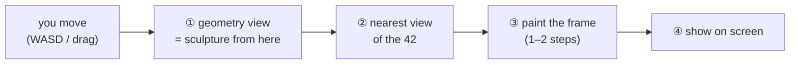

# How WorldFM works — the two phases (simple version)

> **The shortest, plainest telling of how WorldFM works.** If the
> [full explainer](index.md) is too much, read this page: it covers just the **two phases**
> (offline build → online frame loop) and the one question everyone asks —
> *where does the point cloud live, RAM or VRAM?* For the full tour (architecture, training,
> evaluation), go to [WorldFM Explained](index.md).

WorldFM runs in two phases — **Offline** and **Online**.

---

## Phase 1 — the offline build (slow, done once per scene)

Take the one input photo and turn it into a full 3D understanding of the scene:

1. **Panorama generation (FLUX)**: "guess" the full 360° surroundings from the single photo. The
   model FLUX.1-Fill-dev paints a panoramic image that extends what the photo shows in every
   direction.
2. **Depth estimation (MoGe)**: figure out how far away each pixel of that panorama is — turning
   the flat image into 3D.
3. **Point cloud (PLY)**: combine panorama + depth into a cloud of millions of 3D points (a `.ply`
   file) — a rough 3D sculpture of the scene.

This phase uses a lot of memory. It's done once and cached. The result is a point cloud.

### So where does the point cloud cache — RAM or VRAM?

All three places, but each with a different job:

| Place | Role | When |
|---|---|---|
| **Disk** | the `.ply` file — the durable, permanent copy (one per scene) | forever |
| **RAM** (CPU) | a brief pass-through while the file is read (numpy) | only at boot |
| **VRAM** (GPU) | the *working* copy the live loop actually uses, in **half-precision (fp16)** | the whole session |

So: the point cloud is *stored* on disk, *passes through* RAM, and **stays resident in VRAM**. When
the server boots, it reads the `.ply` from disk and uploads the points to the GPU **once**, keeping
them there for the entire session. Every single frame of the live loop reuses that same VRAM copy —
no reloading, no disk access, no re-upload.

!!! tip "Why fp16?"
    Storing the points in **half-precision (fp16)** roughly halves their GPU footprint, which is what
    keeps a few million points small enough to fit a 16 GB card alongside the model weights.

> The 42 pre-made reference views (**cond2**) are also cached in VRAM — and *pre-encoded into
> latents* on the GPU, so picking one per frame is a lookup, not work. See
> [Live-loop internals](live-loop-internals.md) for the byte-level detail.

---

## Phase 2 — the online loop (fast, every frame)

This is the part that runs in real time as you fly around. Every time you move the camera, WorldFM
paints a brand-new view by mixing three things: **where you are**, **the 3D sculpture**, and **a
nearby reference view**. Per frame:

1. **Camera move (your input)**: you press WASD or drag the mouse — "move the camera here." WorldFM
   only needs your new position.
2. **Geometry view (cond1)**: look at the 3D point cloud from your new spot — like shining a
   flashlight on the sculpture to see its shape. You get a rough, holey picture of the scene from
   where you stand. It tells the model *"here's the shape of the room."*
3. **Reference view (cond2)**: out of the **42 views cut from the panorama** (8 directions × 5 tilts
   + up + down, made once in Phase 1), grab the one closest to where you are. It tells the model
   *"here's roughly what it should look like from nearby."*
4. **Paint the frame (the diffusion model)**: give the model three things side by side — a blank
   slate of TV static, the geometry view, and the reference view — and let it clean the static into a
   real picture. Thanks to special "distillation" training, this takes only **1 or 2 steps** instead
   of the usual 20–50.
5. **Show it (decode)**: turn the model's answer into a normal photo and send it to your screen.

Then it repeats — many times per second — for as long as you keep moving.

### Why it's fast

The slow guessing — the panorama, the depth, the sculpture — already happened **once** in Phase 1.
Phase 2 just reuses that finished work, so each frame is cheap. That's the whole trick:

> **Pay the heavy cost once (Phase 1), then fly for free (Phase 2).**

---

## Go deeper

- **Full tour** (architecture, training data, evaluation, checkpoints): [WorldFM Explained](index.md).
- **Why free-fly can look bad** (leaving the reconstructed region, cond2 snapping, no temporal
  coherence): [WorldFM Explained §10](index.md#10-how-good-is-it-evaluation-the-honest-part).
- **Frame-loop internals** (thread affinity, caching, pose conventions): [Live-loop internals](live-loop-internals.md).
