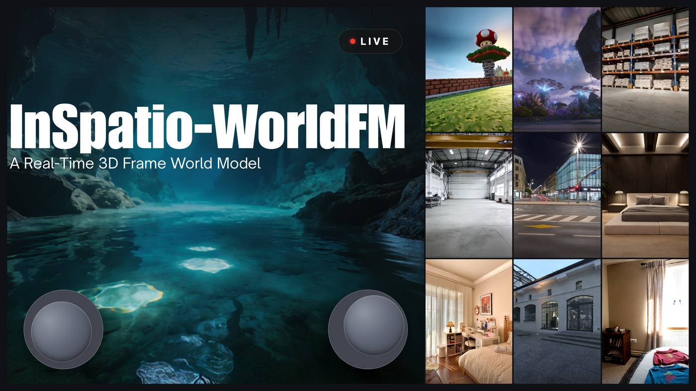
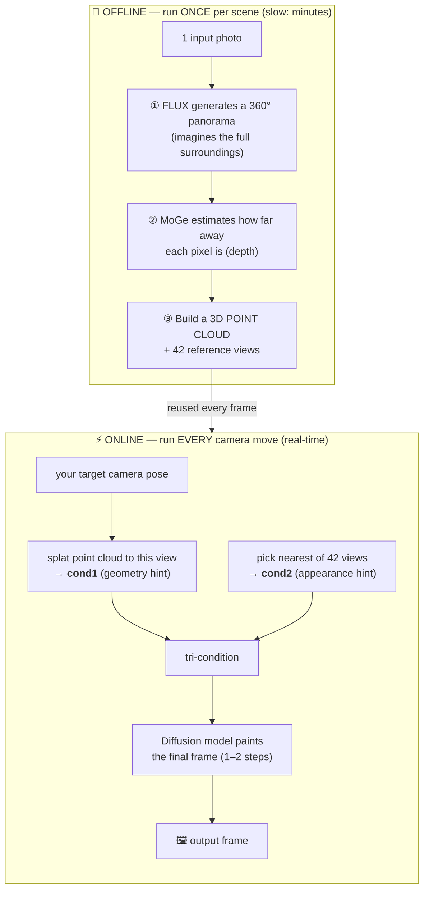
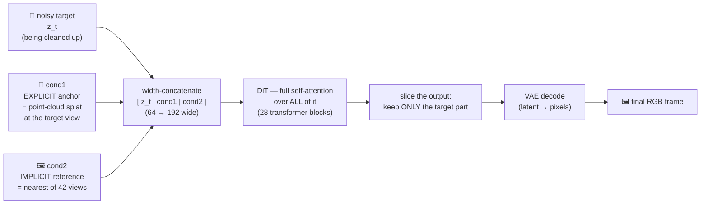
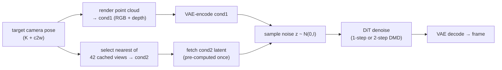
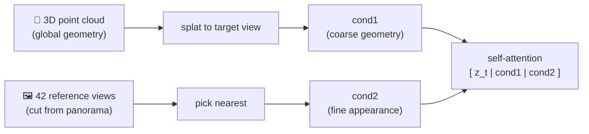
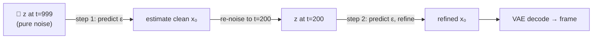
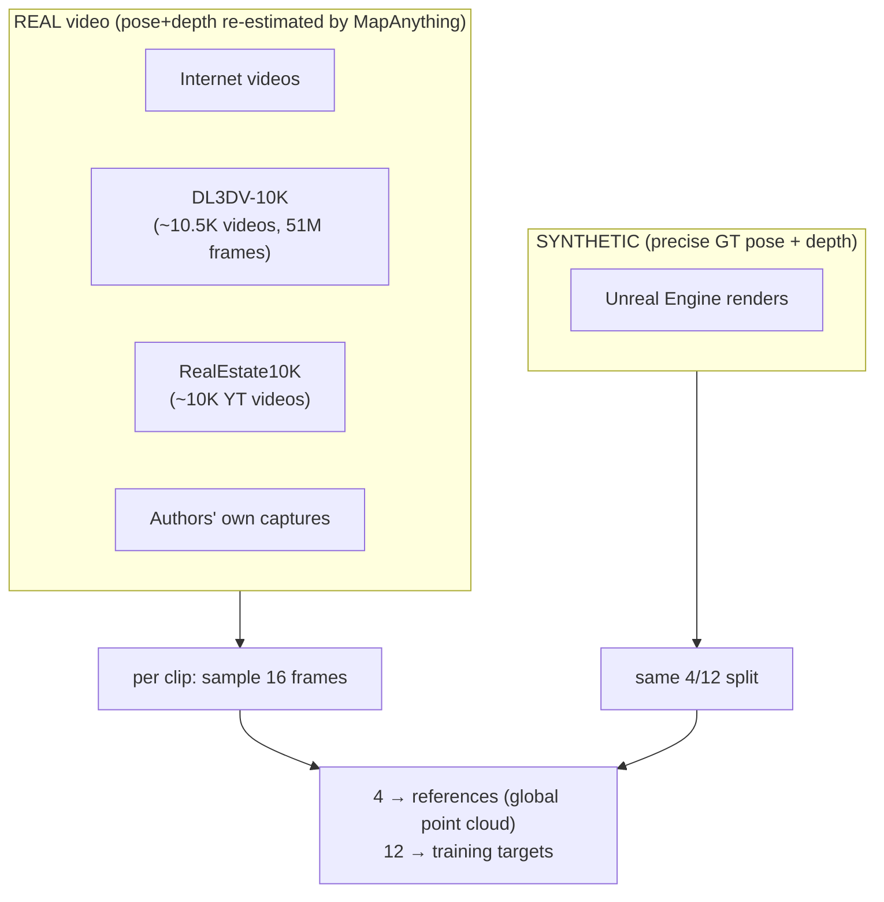
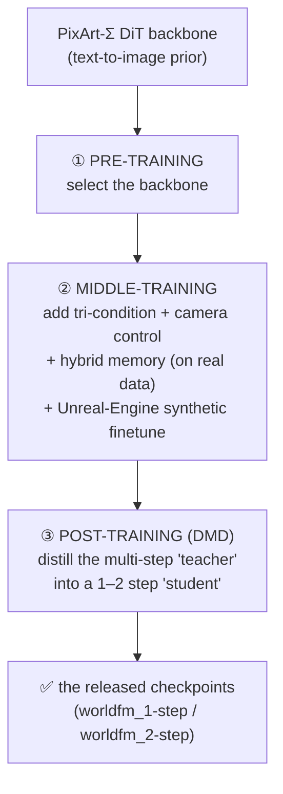

# WorldFM, explained

> **New here? Read this page top-to-bottom.** It walks through the whole thing in plain
> language — what WorldFM *does*, how it works under the hood, what it was trained on, how good
> it is, and how to run it — with diagrams and **every piece of jargon explained the first time
> it appears** (look for the `📖 Jargon` boxes). The rest of this site (*Run & use*, *Deep
> dives*) is reference depth on top of this page.

<figure markdown>
  
  <figcaption><em>WorldFM (InSpatio-WorldFM, arXiv 2603.11911): give it one photo, fly a virtual camera around, and it synthesizes plausible views of the scene from new angles — including parts the original photo couldn't see.</em></figcaption>
</figure>

---

## 1. What WorldFM does (in one minute)

**Give it ONE ordinary photograph of a scene. It lets you move a virtual camera around and
synthesizes what the scene would look like from new angles** — even angles the original photo
couldn't see (behind objects, off to the sides). It does this **in real time**: ~3.9 frames/sec
on this 4060 Ti box (the paper claims ~10 FPS on an RTX 4090, ~25 on an H-series data-center GPU).

Crucially, it is **generative** — it doesn't just rotate a 3D model you gave it. For anything the
photo couldn't see, the model **imagines** plausible detail. That word *imagines* explains most of
WorldFM's strengths (it can fill in unseen regions) and most of its weaknesses (it can also
hallucinate nonsense, especially when you fly somewhere with no information).

!!! info "📖 Jargon — **Novel-View Synthesis (NVS)**"
    **Novel-view synthesis** = generating images of a scene from camera viewpoints you did *not*
    photograph. "Novel" = new. WorldFM is an NVS model. A related term you'll see is **world
    model** — a model that has learned enough about how 3D scenes look that it can imagine them
    consistently. WorldFM is marketed as a (real-time, single-image) world model.

---

## 2. The big picture: two phases

WorldFM splits the work into a **slow offline step** (done once per scene) and a **fast online
step** (run every time you move the camera). This split is the whole shape of the system — and
it explains a lot of the behavior you'll see.



- **Phase 1 (offline, once):** turn the one photo into a **360° panorama** (with FLUX), estimate
  **depth** (with MoGe), and from those build a **3D point cloud** + a set of **42 reference
  views**. This is heavy (minutes) but only happens once per scene, and the result is cached.
- **Phase 2 (online, per move):** for whatever new camera angle you want, take a **fresh rendering
  of the point cloud** from that angle (= **cond1**, the geometry hint), pick the **nearest of the
  42 reference views** (= **cond2**, the appearance hint), and feed both into a **diffusion model**
  that paints the final detailed frame. This is the "real-time" part.

!!! tip "Why this split matters to you"
    The slow, memory-heavy part (FLUX panorama + MoGe depth) is **offline only**. The fast part is
    just the frame model + a cheap point-cloud splat. So on this 16 GB box we could only afford to
    run Phase 1 at reduced quality (see [16 GB modifications](repo-mods.md)) — and that reduced
    Phase-1 quality is the main reason free-fly output degrades (more in §10).

---

## 3. Concepts you'll need (jargon buster)

A few ideas come up repeatedly. Skim this, then refer back when a term appears.

!!! info "📖 Diffusion model"
    A **diffusion model** generates an image by **starting from pure random noise** (think TV
    static) and **progressively cleaning it up**, step by step, nudged by "conditions" (hints about
    what to draw). It's like carving a statue out of a block of static. Many denoising steps →
    high quality but slow. WorldFM is distilled to **1–2 steps** for speed (see DMD below).

!!! info "📖 Latent diffusion + VAE"
    Cleaning up a full 512×512 image every step is expensive. So the model works in a compressed
    **latent space**: a **VAE** (Variational Autoencoder — here a Stable-Diffusion `AutoencoderKL`)
    squashes each 512×512 image down to a **64×64×4 latent** (8× smaller each way), the diffusion
    happens on that small latent, and the VAE decodes it back to pixels at the end. "Latent
    diffusion" = diffusion in this compressed space.

!!! info "📖 DiT (Diffusion Transformer)"
    The network that does the denoising is a **transformer** (the same family as GPT/transformers
    in NLP), operating on the latent chopped into **patches/tokens** — not the older U-Net. WorldFM
    uses a **PixArt-Σ** DiT (a text-to-image model family), config **XL_2** (28 layers, hidden
    size 1152, patch size 2, 16 heads).

!!! info "📖 Conditioning (cond1 / cond2)"
    "Conditions" are the hints that steer the diffusion toward the scene you want. WorldFM uses
    **two image conditions**: **cond1** = a coarse 3D rendering of the scene geometry at the target
    view (the "explicit anchor"); **cond2** = a nearby reference photo (the "implicit memory").
    More in §5.

!!! info "📖 Distillation / DMD"
    A raw diffusion model needs 20–50 steps — too slow for real time. **Distillation** trains a
    small "student" to match a slow "teacher" in **few steps**. WorldFM uses **DMD** (Distribution
    Matching Distillation) to get to **1 or 2 steps**. Trade-off: fewer steps = faster but lower
    quality (2-step > 1-step).

!!! info "📖 NeRF / Gaussian Splatting vs. generative NVS"
    Other ways to make novel views **reconstruct an explicit 3D scene** (NeRF, Gaussian Splatting)
    — fast and perfectly consistent, but they **cannot imagine unseen content**. WorldFM is
    **generative** (it hallucinates), so it can fill unseen regions — at the cost of consistency
    and occasional nonsense. You can't have all of {real-time, consistent, high-quality,
    generative} at once; it's an open trade-off.

---

## 4. The architecture (how a frame is generated)

The heart of WorldFM is one big idea: **don't use cross-attention for the conditions — just
stack the target, the geometry hint, and the reference hint side-by-side and run one
self-attention over all of them.**



**Read the diagram left-to-right:**

1. **Three latents are concatenated along the width** — the noisy target (the thing being drawn),
   plus the two clean condition latents (cond1, cond2). All three share one patch-embedding and
   positional encoding.
2. **One self-attention DiT** mixes them — so the target can "look at" both the geometry and the
   reference while denoising. (Text/cross-attention is **off** — WorldFM is pose + image only, no
   text prompts.)
3. After the last block, **only the target slice is kept** (the cond1/cond2 parts are discarded).
4. The VAE **decodes** that target latent back to a 512×512 RGB image.

!!! tip "Why 'concat + self-attention' instead of cross-attention?"
    In cross-attention the conditions sit in a separate "key/value bank" the target reads from. By
    **concatenating** everything into one stream, target, geometry, and reference can all attend to
    **each other** freely — the paper found this beats cross-attention on quality. The cost is a
    wider token sequence, but it's still just **one forward pass per frame** (that's what makes it
    real-time).

**The full per-frame pipeline** (the online path) looks like this:



---

## 5. The two conditions: cond1 and cond2

WorldFM "knows" the scene through **two complementary channels** — together called the **hybrid
spatial memory**:

| | **cond1 — explicit 3D anchor** | **cond2 — implicit reference** |
|---|---|---|
| **What it is** | a rendering of the cached **3D point cloud** at the target view | the **nearest of 42 pre-made reference photos** |
| **Carries** | coarse **geometry** (where surfaces are) | fine **appearance** (colors, textures) |
| **Built** | offline (panorama → depth → point cloud) | offline (42 views cut from the panorama) |
| **Online cost** | re-rendered fresh each frame (cheap splat) | just looked up by index (its VAE latent is pre-computed once) |
| **Strength** | anchors the scene in 3D — **prevents drift** | supplies realistic detail, lets the model **hallucinate plausibly** |
| **Weakness** | sparse/gappy (points, not a solid mesh); degrades outside the reconstructed bubble | only 42 discrete views → "snaps" between them as you move |



!!! warning "The 'good region' (why free-fly degrades)"
    The point cloud (cond1) only exists where the panorama could be reconstructed — a **bubble**
    around the start. **Fly outside that bubble and cond1 goes blank**, so the model is conditioning
    on almost nothing and hallucinates freely → nonsense. cond2 also "snaps" between only 42 views
    → visible pops. This is the #1 reason live free-fly looks bad (not a bug — see §10).

---

## 6. How one frame is denoised (the 1-step vs 2-step choice)

The diffusion model runs **1 or 2 denoising steps** (it's distilled — DMD). On the **2-step**
schedule (the default, better quality):



- **Step 1** denoises from `t=999` (pure noise) down to an intermediate `t=200` — establishes the
  **coarse structure**.
- **Step 2** denoises from `t=200` to `0` — a dedicated **fine-detail refinement** pass.
- **1-step** skips step 2 (fastest, ~3.9 FPS here, lower quality); **2-step** is the default
  (~2.6 FPS, sharper). `t_mid = 200` (on a 1000-step schedule) is the paper's chosen sweet spot.

!!! info "📖 cfg_scale"
    Classifier-free guidance (`cfg_scale`) is a knob that boosts condition-following. WorldFM's
    shipped 1-/2-step path **hardcodes `cfg_scale = 0.0`** (no CFG) — the `4.5` you'll see in the
    config applies only to the slow multi-step fallback path. So the default model runs without CFG.

---

## 7. The 3D point cloud (cond1's source)

The point cloud is **built once, offline**, and only **rendered** (splatted) online.

- **Offline build (`compute_ply_arrays`):** every pixel of the 360° panorama at longitude θ,
  latitude φ, with depth `r`, is **back-projected** to a 3D point:
  ```
  X = r · sin(φ) · cos(θ)
  Y = −r · cos(φ)
  Z = −r · sin(φ) · sin(θ)
  ```
  → ~8.4 million points for the `mario` scene. Picture draping the photo over a depth-shaped dome.
- **Online render:** for the current camera, project the points in (`z = depth`, pinhole),
  **z-buffer** (nearest point wins each pixel), splat its color → cond1. No new points are ever
  created at runtime.

!!! info "📖 Point cloud / splat / z-buffer"
    A **point cloud** is a cloud of 3D dots marking where surfaces are. **Splatting** = projecting
    those dots onto a camera's screen. A **z-buffer** keeps, per pixel, the nearest dot (so closer
    surfaces hide farther ones). The result is a gappy, sponge-like image — a rough geometry sketch.

---

## 8. Training data (what it learned from)

!!! warning "Heads up"
    The paper **does not state dataset size, #clips, #frames, GPUs, or training compute**. What
    follows is the *composition* it names — not counts.



- **Real sources:** internet videos, **DL3DV-10K**, **RealEstate10K**, the authors' own captures.
  These are used as **raw video only** — pose + depth are **re-estimated uniformly by MapAnything**
  (a feedforward 3D model), *not* the datasets' own ground-truth poses.
- **Synthetic:** **Unreal Engine** renders with **perfect GT pose + depth**, used for a **light
  finetune** to correct the errors MapAnything introduces (a "limited number of steps" — count
  unstated).
- **Per-clip recipe:** sample 16 frames → **4 become references** (unprojected into one global
  point cloud) + **12 become training targets** (each target's reference = the temporally-closest
  of the 4). This **mirrors the runtime conditioning** (cond1 = the 4-frame cloud; cond2 = nearest
  reference) so there's no train/inference mismatch.
- **No text/captions** — pose/image-conditioned only.

!!! info "📖 MapAnything"
    A **feedforward 3D-reconstruction model** (Meta). Feed it images → it regresses per-frame
    camera pose + depth. WorldFM uses it to manufacture (pose, depth) labels for raw video at
    training time. Its estimates "inevitably contain errors" — which is exactly why the synthetic
    GT finetune exists.

---

## 9. Training & distillation (3 stages)

All three stages are **paper-only** — the release is **inference-only** (no training code/data).



- **Stage 1 — Pre-training:** select PixArt-Σ as the image-generation prior.
- **Stage 2 — Middle-training:** turn it into a **controllable frame model** — add the tri-condition
  concat, the camera-pose encoding (PRoPE), and the hybrid spatial memory; train on the real
  corpus; then a light **Unreal-Engine synthetic finetune**.
- **Stage 3 — Post-training (DMD):** distill the slow multi-step "teacher" (Stage 2's output) into
  the released **1-/2-step student**. This is where real-time speed comes from.

!!! info "📖 DMD (Distribution Matching Distillation)"
    Keep two models during training: a **frozen copy of the teacher** (the "real score") and a
    **dynamically-updated critic** trained on the student's outputs (the "fake score"). Train the
    student so its output **distribution matches** the teacher's (approximate-KL), plus a regression
    loss. Result: a 1–2 step student that behaves like the many-step teacher.

---

## 10. How good is it? (evaluation — the honest part)

!!! warning "Read this before trusting any quality claim"
    The paper's evaluation is **qualitative only**. It reports **no FID, no PSNR, no LPIPS, no
    multi-view-consistency metric, no benchmark tables, and no user study.** "Strong multi-view
    consistency" and "minimal perceptual difference after distillation" are **asserted by showing
    picture grids (Figs. 4–8), not measured**.

- **Results** = 5 figure grids (each = 1 reference photo + 10 generated novel views).
- **"Baselines":** **RTFM** and **StarGen** are mentioned **only as related work / design
  context — they are *not* experimentally compared against**. The only actual comparison is the
  authors' **own teacher vs distilled student**, by eye.
- **Internal ablations** (also qualitative): camera encodings (Plücker vs **PRoPE** vs
  pure-parametric → PRoPE chosen) and DMD schedule (2-step > 1-step; `t_mid=200` best).
- **The only numbers are runtime:** ~25 FPS @ 512² on an H-series GPU, ~10 FPS on RTX 4090.

!!! info "📖 FID / PSNR / LPIPS — and the damning part"
    **FID/KID** measure distributional realism (no ground-truth image needed). **PSNR/SSIM/LPIPS**
    measure fidelity vs a ground-truth photo. Crucially, the **multi-view-consistency metrics**
    (**MEt3R**, **Flow Warping Score**, **regrounding**) require **no ground truth** — they're
    computable on the model's own outputs. So a "world model" claiming consistency has **no excuse**
    for omitting them; WorldFM reports none. Treat its quality as "looks plausible by example," not
    "measured to be good."

**Why your live fly-through looked bad** — it's the stack of: (1) **no temporal coherence** (each
frame is an independent hallucination with fresh noise → flicker); (2) **leaving the reconstructed
region** (cond1 goes blank → garbage); (3) **cond2 snapping** between 42 views; (4) our **16 GB-fit
config** (NF4 FLUX + reduced MoGe depth = coarser point cloud than the paper's); (5) **step-1**
(the fast, lower-quality decode). None is a bug; they're the consequences of the frame-based design
+ the memory budget.

---

## 11. The released model checkpoints

| File | Size | What |
|---|---|---|
| `weights/worldfm_2-step.pth` | ~2.46 GB | 2-step DMD-distilled **student** (default, quality) |
| `weights/worldfm_1-step.pth` | ~2.46 GB | 1-step DMD-distilled **student** (fast) |
| `weights/vae/...` | ~320 MB | the `AutoencoderKL` VAE |

- **Same architecture** (`PixArtWorldFMMS_XL_2`) for both — they differ only in the distillation
  schedule. Parameter count is **not stated** (~0.6 B is an estimate from the 2.46 GB fp32 file).
- **Produced by** Stage-3 DMD distillation of the Stage-2 teacher.
- **Withheld:** the teacher, the DMD critic, all Stage-1/2 training weights, all training code/data.
- **Licensing:** the WorldFM code + checkpoints + VAE are **Apache-2.0** — but a full pipeline is
  **non-commercial** because FLUX.1-Fill-dev, HunyuanWorld-1.0, and ZIM all carry non-commercial
  terms.

---

## 12. How to run it

- **Interactive fly-through (live loop):** `bash scripts/serve.sh`, then open the viewer — see
  [Live loop](live-loop.md).
- **Batch demo (fixed trajectory → video):** see [Run guide](run-guide.md).
- **Make it fit 16 GB:** the required config overrides are in [16 GB modifications](repo-mods.md).

---

## 13. Glossary

| Term | Meaning |
|---|---|
| **NVS** | Novel-View Synthesis — generating images of a scene from new camera viewpoints. |
| **World model** | A model that imagines a scene consistently enough to generate/continue it. |
| **Diffusion** | Generate by denoising random noise step-by-step, guided by conditions. |
| **Latent diffusion / VAE** | Diffusion in a compressed "latent" space; a VAE encodes/decodes to/from it. |
| **DiT** | Diffusion Transformer — the denoiser network (here PixArt-Σ XL_2). |
| **cond1 / cond2** | The two image conditions: explicit 3D anchor (point-cloud render) / implicit reference (nearest of 42 views). |
| **Hybrid spatial memory** | cond1 (geometry) + cond2 (appearance) together. |
| **Point cloud / splat** | 3D dots marking surfaces; "splatting" = projecting them to a camera. |
| **DMD** | Distribution Matching Distillation — distills a many-step teacher into a 1–2 step student. |
| **PRoPE** | The paper's *adopted* camera-pose encoding (modulates attention). ⚠️ implemented but **inactive** in the released model. |
| **cfg_scale** | Classifier-free guidance; = 0.0 on the shipped DMD path. |
| **FID / PSNR / LPIPS** | Standard image-quality/consistency metrics — **none reported** by WorldFM. |

---

## 14. What the paper doesn't tell you (caveats)

- **No quantitative metrics** of any kind (no FID/PSNR/LPIPS/consistency) — qualitative only.
- **Model parameter count, dataset size, training compute, step counts** — all unstated.
- **PRoPE** (the paper's chosen camera encoding) is **implemented but inactive** on the shipped
  inference path — unclear whether the released weights were even trained with it.
- **Inference-only release:** all training (Stages 1–3), data curation, and the internal panorama
  model are withheld (HunyuanWorld-1.0 is the open-source substitute).
- **"DPM-Solver++ teacher"** is **code-inferred**, not a paper statement (the paper says only
  "multi-step deterministic sampler").
- Our **16 GB-fit config** runs the offline stage at reduced fidelity (NF4 FLUX, MoGe
  `resolution_level=9`, smaller merge) — lower anchor quality than the paper's full setup.

---

## 15. Go deeper

This page is the tour. For depth, the **Deep dives** in the sidebar cover the paper + code
mechanism-by-mechanism (formulation, training, data, runtime, diagrams, glossary), each with
verified `path:line` citations. Start with [01 — Big picture](learning/01-big-picture.md) or
[05 — Formulation](learning/05-formulation.md).
